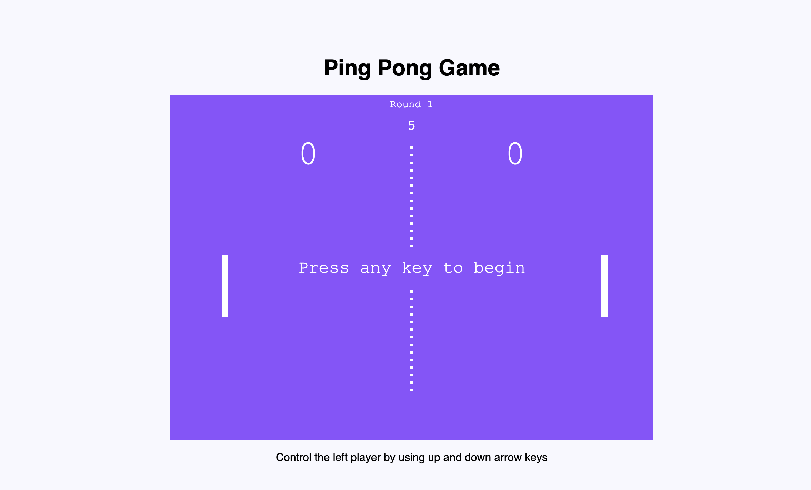

# Ping Pong Game
This is a simple Ping Pong game built using HTML & JavaScript. It provides a fun and interactive way to play the classic Ping Pong game right in your web browser.

## Game Start Window

## Features
- Play against the computer.
- Simple controls: Use the arrow keys to control the paddles.
- Responsive design: Enjoy the game on desktop, tablet, or mobile devices.
- Score tracking: Keep track of your score as you play.

## Getting Started
* Clone the repository or download the files.
* Open the index.html file in your web browser.
* Start playing!

## Contributing
Contributions are welcome! If you have any suggestions, bug reports, or feature requests, please open an issue or submit a pull request.

## Author
- [Shubhra Bhattacharjee](https://github.com/subhra8697) 
